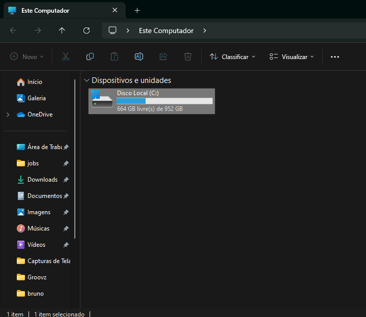
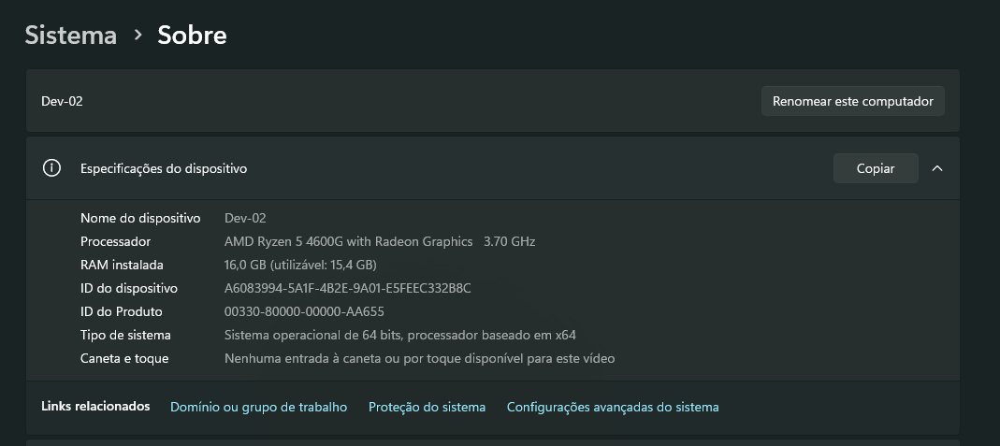
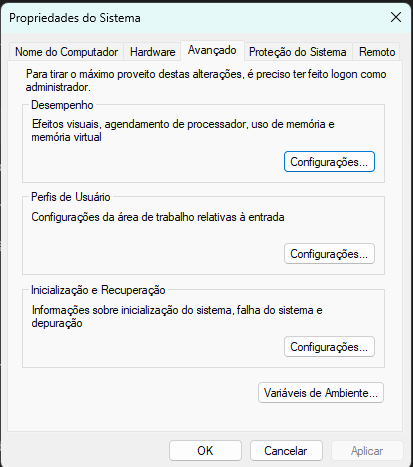
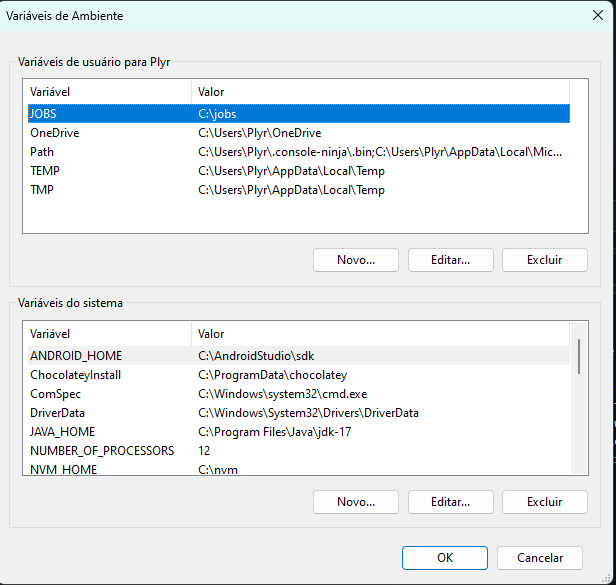
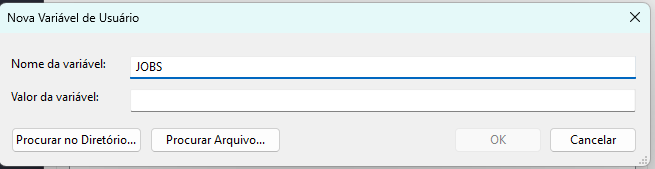
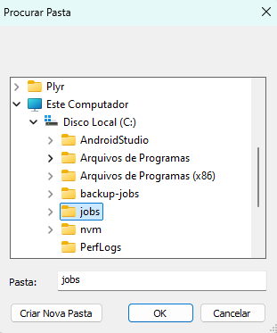

# Plyrtech Criação da pasta JOBS.

## Criação

Para a criação da pasta JOBS, você vai precisar:
- [GitBash](https://git-scm.com/download/win)
- [Windows11](https://www.microsoft.com)

## Passo-a-passo

- Abra a pasta meu computador. Certifique-se de estar na tela **Este Computador**


- Clique com o botão direito na tela, certifique-se de ser em um espaço vazio.
- Clique mais opções.
- Clique em propriedades.
- Clique em 'Configurações avançadas do sistema. 


- Clique em variável de ambiente.


- Dentro de 'Variável de usuário', clique em Novo.


- Em nome da variável digite: JOBS


- Clique em 'Procurar no diretório'.


- Dentro de: 'Este computador', selecione: 'C:\' e crie uma pasta chamada: jobs


- Clique em 'OK'.

- Clique em 'OK'.

- Clique em 'Aplicar'.

- Clique em 'OK'.

## FIM

Agora você consegue usar o comando:

```bash
cd $JOBS
```

**Importante**: Você deve estar dentro de um terminal, **GitBash**